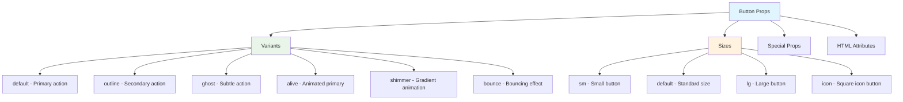
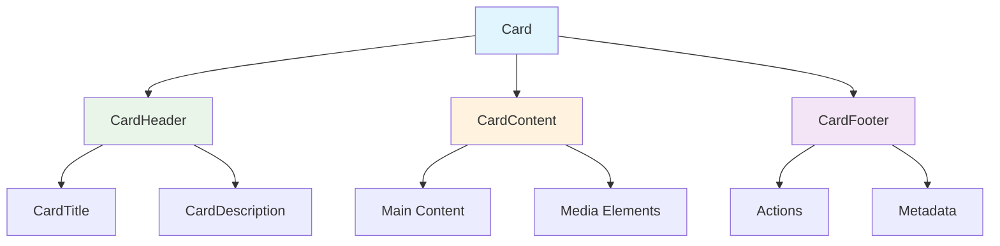
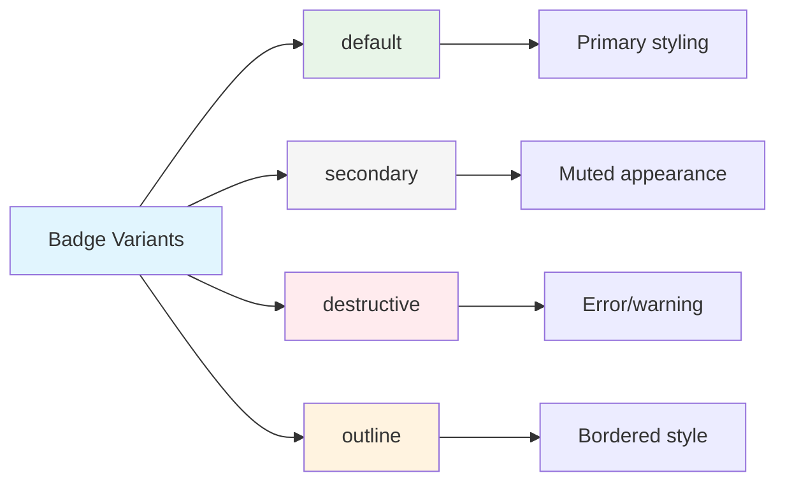
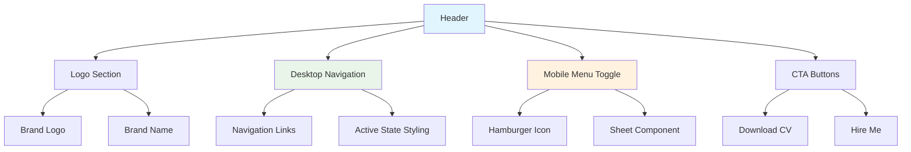
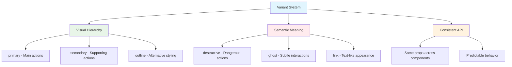
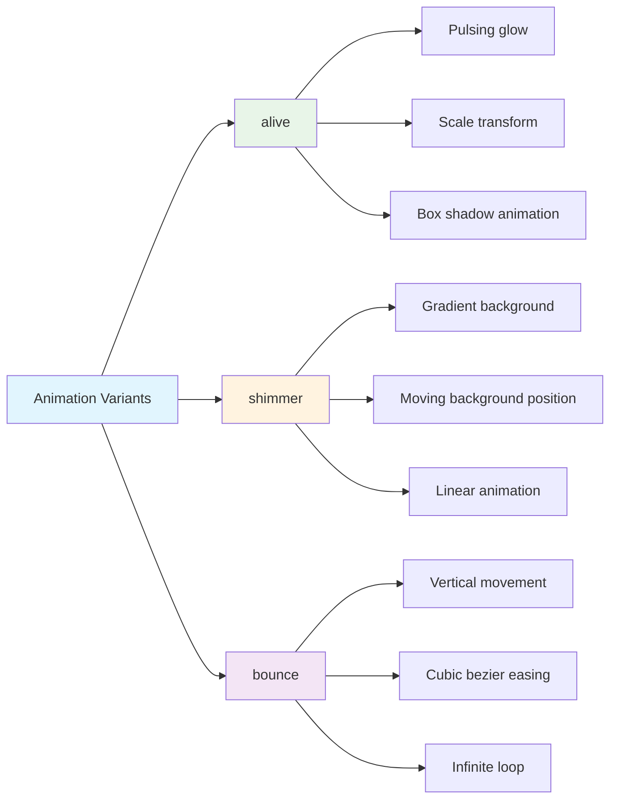

# Component API Documentation

This document provides comprehensive API documentation for all components used in the portfolio application, including props, usage examples, and best practices.

## 🧩 Core Components

### Button Component

A versatile button component with multiple variants and sizes, supporting various interactive states and animations.

```typescript
interface ButtonProps extends React.ButtonHTMLAttributes<HTMLButtonElement> {
  variant?: 'default' | 'destructive' | 'outline' | 'secondary' | 'ghost' | 'link' | 'alive' | 'shimmer' | 'bounce';
  size?: 'default' | 'sm' | 'lg' | 'icon';
  asChild?: boolean;
}
```

#### Props Details



#### Usage Examples

```typescript
// Basic button
<Button>Click me</Button>

// Variant buttons
<Button variant="outline">Secondary Action</Button>
<Button variant="destructive">Delete Item</Button>

// Animated buttons
<Button variant="alive">Get Started</Button>
<Button variant="shimmer">Premium Feature</Button>
<Button variant="bounce">Call to Action</Button>

// Different sizes
<Button size="sm">Small</Button>
<Button size="lg">Large</Button>
<Button size="icon"><Heart className="h-4 w-4" /></Button>

// With event handlers
<Button onClick={handleClick} disabled={isLoading}>
  {isLoading ? 'Loading...' : 'Submit'}
</Button>

// As child component (using Slot)
<Button asChild>
  <Link to="/projects">View Projects</Link>
</Button>
```

### Card Component

A flexible container component for grouping related content with consistent styling.

```typescript
interface CardProps extends React.HTMLAttributes<HTMLDivElement> {
  className?: string;
}

interface CardHeaderProps extends React.HTMLAttributes<HTMLDivElement> {
  className?: string;
}

interface CardContentProps extends React.HTMLAttributes<HTMLDivElement> {
  className?: string;
}

interface CardTitleProps extends React.HTMLAttributes<HTMLHeadingElement> {
  className?: string;
}
```

#### Card Structure



#### Usage Examples

```typescript
// Basic card
<Card>
  <CardHeader>
    <CardTitle>Project Title</CardTitle>
    <CardDescription>Brief project description</CardDescription>
  </CardHeader>
  <CardContent>
    <p>Detailed project content goes here...</p>
  </CardContent>
</Card>

// Project showcase card
<Card className="group hover:shadow-lg transition-all duration-300">
  <div className="aspect-video overflow-hidden">
    
  </div>
  <CardContent className="p-6">
    <CardTitle className="mb-2">{project.title}</CardTitle>
    <CardDescription className="mb-4">{project.description}</CardDescription>
    <div className="flex flex-wrap gap-2">
      {project.technologies.map((tech) => (
        <Badge key={tech} variant="secondary">{tech}</Badge>
      ))}
    </div>
  </CardContent>
</Card>
```

### Avatar Component

Displays user profile pictures with fallback support and accessibility features.

```typescript
interface AvatarProps extends React.HTMLAttributes<HTMLSpanElement> {
  className?: string;
}

interface AvatarImageProps extends React.ImgHTMLAttributes<HTMLImageElement> {
  className?: string;
}

interface AvatarFallbackProps extends React.HTMLAttributes<HTMLSpanElement> {
  className?: string;
}
```

#### Usage Examples

```typescript
// Basic avatar with image and fallback
<Avatar className="w-32 h-32">
  <AvatarImage src="/profile.jpg" alt="Djoko Waluyo" />
  <AvatarFallback>DW</AvatarFallback>
</Avatar>

// Different sizes
<Avatar className="w-8 h-8">
  <AvatarImage src="/profile.jpg" alt="User" />
  <AvatarFallback>U</AvatarFallback>
</Avatar>

// With border and styling
<Avatar className="w-24 h-24 border-4 border-primary/20">
  <AvatarImage src="/profile.jpg" alt="Profile" />
  <AvatarFallback className="text-lg bg-primary text-primary-foreground">
    DW
  </AvatarFallback>
</Avatar>
```

### Badge Component

Small status indicators and labels for categorizing content.

```typescript
interface BadgeProps extends React.HTMLAttributes<HTMLDivElement> {
  variant?: 'default' | 'secondary' | 'destructive' | 'outline';
  className?: string;
}
```

#### Badge Variants



#### Usage Examples

```typescript
// Technology tags
{technologies.map((tech) => (
  <Badge key={tech} variant="secondary" className="text-xs">
    {tech}
  </Badge>
))}

// Status indicators
<Badge variant="default">Active</Badge>
<Badge variant="destructive">Deprecated</Badge>
<Badge variant="outline">Draft</Badge>

// Custom styling
<Badge className="bg-gradient-to-r from-blue-500 to-purple-600 text-white">
  Featured
</Badge>
```

## 📐 Layout Components

### Header Component

Navigation header with responsive design and mobile menu support.

```typescript
interface HeaderProps {
  // No props needed - uses internal state and routing
}
```

#### Header Structure



#### Features

- **Responsive Design**: Desktop horizontal menu, mobile slide-out panel
- **Active States**: Highlights current page in navigation
- **Sticky Positioning**: Remains visible during scroll
- **Backdrop Blur**: Modern glass-morphism effect
- **Keyboard Accessible**: Full keyboard navigation support

#### Usage

```typescript
// Header is automatically included in App.tsx
import Header from './components/Header';

function App() {
  return (
    <BrowserRouter>
      <Header />
      <Routes>
        {/* Page routes */}
      </Routes>
    </BrowserRouter>
  );
}
```

## 🎨 Styling Props

### Variant System

Most components use a consistent variant system for styling:



### Size System

Consistent sizing across components:

```typescript
type Size = 'sm' | 'default' | 'lg' | 'icon';

// Implementation varies by component but follows pattern:
const sizes = {
  sm: "h-8 px-3 text-xs",
  default: "h-9 px-4 py-2",
  lg: "h-10 px-8",
  icon: "h-9 w-9"
};
```

## 🎭 Animation Components

### Animated Button Variants

Special button variants with built-in animations:

```typescript
// Alive variant - Pulsing glow effect
<Button variant="alive">
  Get Started
</Button>

// Shimmer variant - Moving gradient
<Button variant="shimmer">
  Premium Feature
</Button>

// Bounce variant - Subtle bouncing
<Button variant="bounce">
  Call to Action
</Button>
```

#### Animation Details



## 🔧 Custom Hooks Integration

Components are designed to work seamlessly with custom hooks:

```typescript
// Example with custom hooks
const ProjectCard = ({ project }) => {
  const { isVisible, ref } = useIntersectionObserver();
  const { isMobile } = useMobile();
  
  return (
    <Card 
      ref={ref}
      className={`transition-all duration-500 ${
        isVisible ? 'opacity-100 translate-y-0' : 'opacity-0 translate-y-4'
      }`}
    >
      <CardContent className={isMobile ? 'p-4' : 'p-6'}>
        {/* Card content */}
      </CardContent>
    </Card>
  );
};
```

## ♿ Accessibility Features

All components include accessibility features:

- **Keyboard Navigation**: Full keyboard support
- **Screen Reader Support**: Proper ARIA labels and descriptions
- **Focus Management**: Visible focus indicators
- **Color Contrast**: WCAG AA compliant color ratios
- **Semantic HTML**: Proper HTML element usage

## 🧪 Testing Components

Components are designed for easy testing:

```typescript
import { render, screen, fireEvent } from '@testing-library/react';
import { Button } from '@/components/ui/button';

test('button handles click events', () => {
  const handleClick = jest.fn();
  render(<Button onClick={handleClick}>Click me</Button>);
  
  fireEvent.click(screen.getByRole('button'));
  expect(handleClick).toHaveBeenCalledTimes(1);
});

test('button supports different variants', () => {
  render(<Button variant="destructive">Delete</Button>);
  expect(screen.getByRole('button')).toHaveClass('bg-destructive');
});
```

This API documentation provides the foundation for effectively using and extending components throughout the portfolio application.