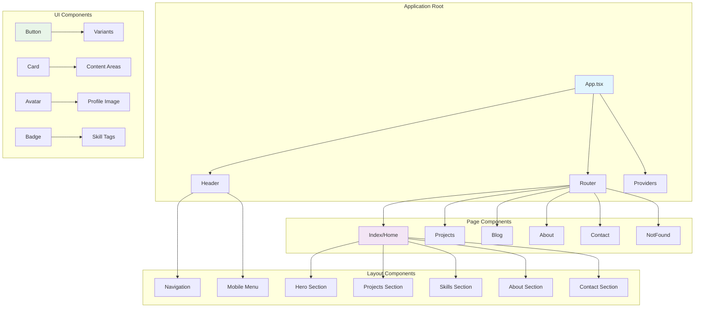
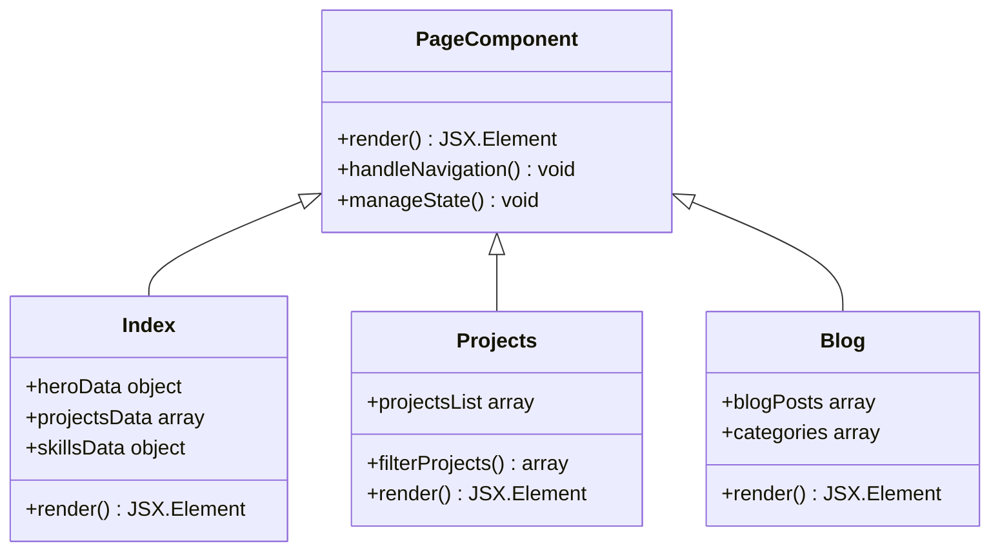
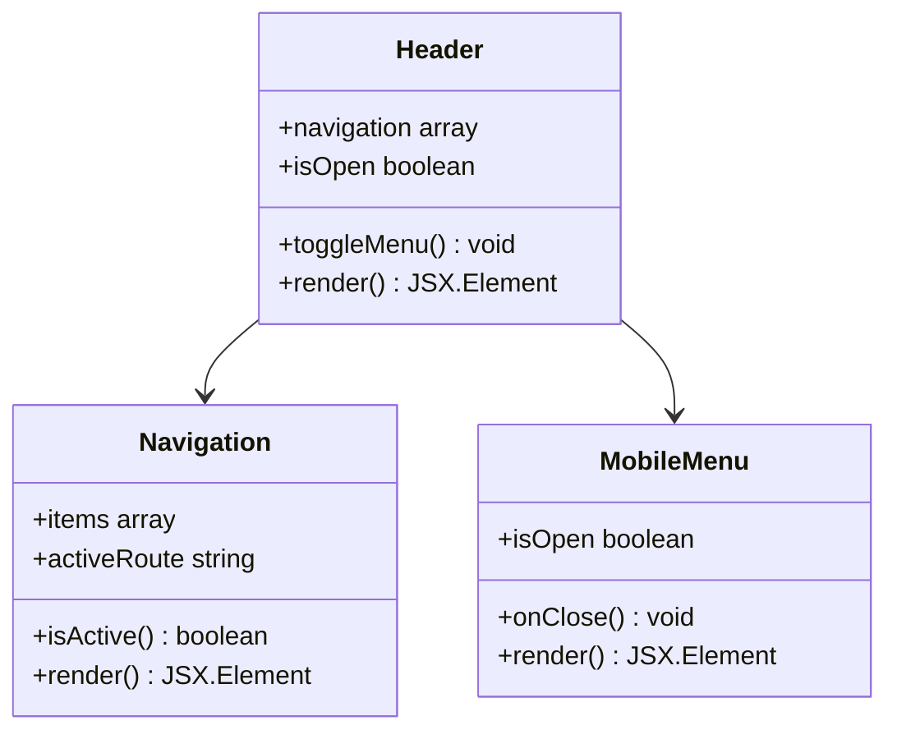
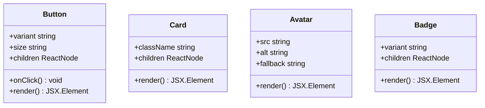
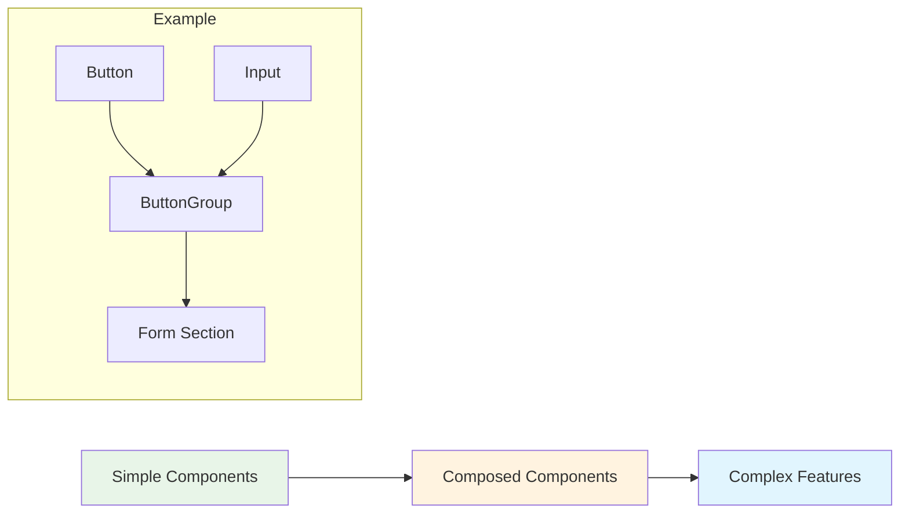
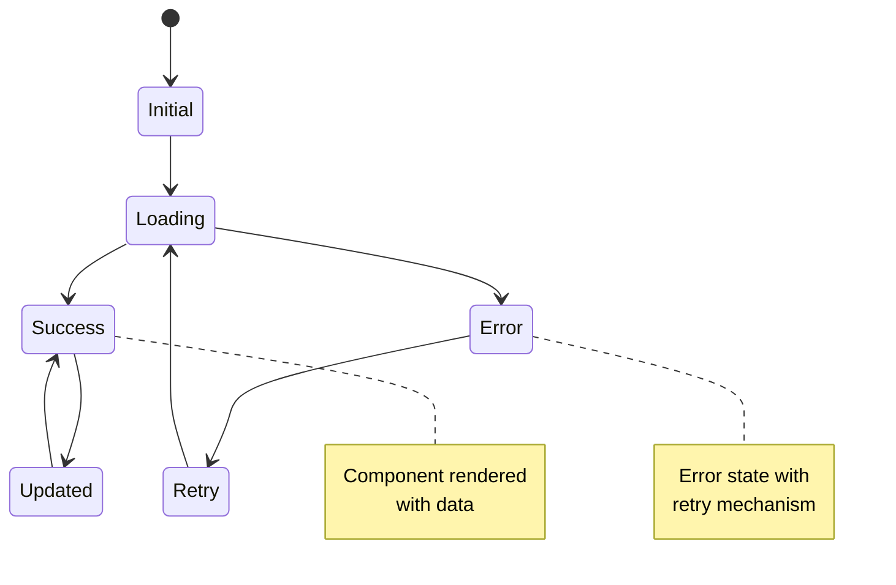
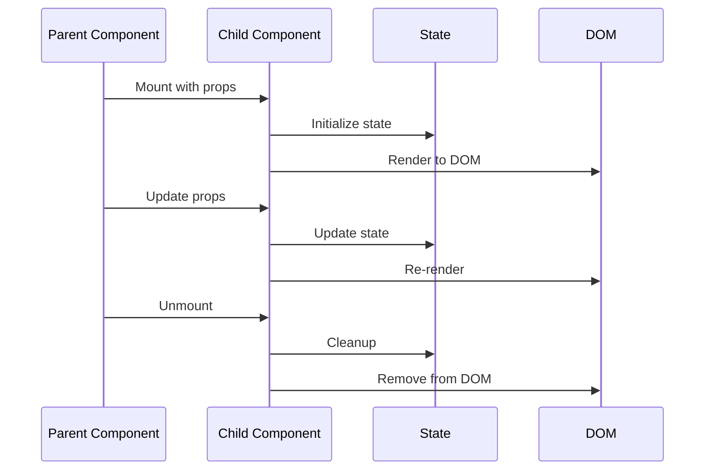
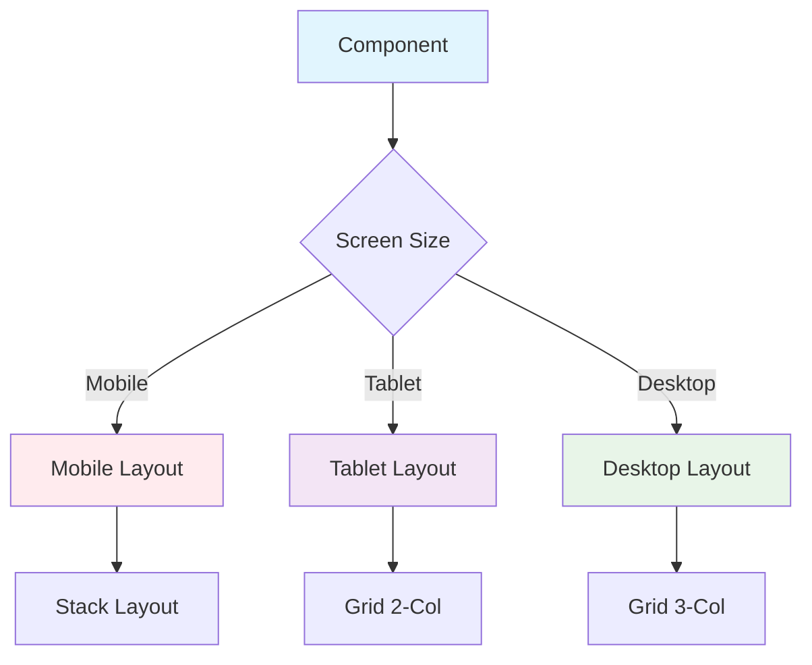
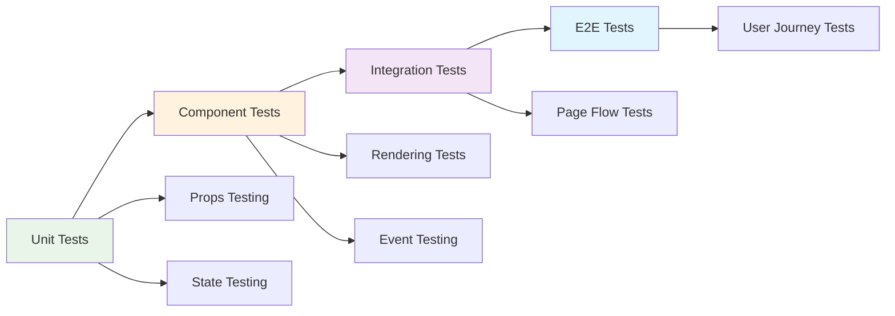
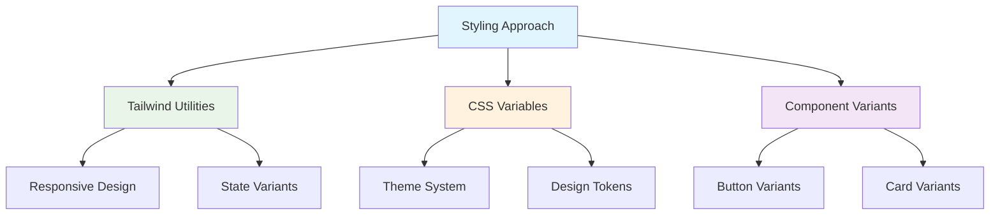

# Component Architecture

This document details the component structure, hierarchy, and design patterns used throughout the portfolio application.

## 🏗️ Component Hierarchy



## 📦 Component Categories

### 1. Page Components
High-level components that represent entire pages and contain business logic.



### 2. Layout Components
Components responsible for page structure and navigation.



### 3. UI Components (shadcn/ui)
Reusable, atomic UI components with consistent styling.



## 🎨 Component Design Patterns

### 1. Compound Components
Components that work together to form a cohesive unit.

```typescript
// Card compound component example
<Card>
  <CardHeader>
    <CardTitle>Project Title</CardTitle>
  </CardHeader>
  <CardContent>
    <CardDescription>Project description</CardDescription>
  </CardContent>
</Card>
```

### 2. Render Props Pattern
Components that share logic through function props.

```typescript
// Example of render prop pattern
<DataProvider>
  {({ data, loading, error }) => (
    loading ? <Skeleton /> : <Content data={data} />
  )}
</DataProvider>
```

### 3. Composition Pattern
Building complex UIs by composing simple components.



## 🔧 Component Props Interface

### Button Component Props
```typescript
interface ButtonProps {
  variant?: 'default' | 'destructive' | 'outline' | 'secondary' | 'ghost' | 'link' | 'alive' | 'shimmer' | 'bounce'
  size?: 'default' | 'sm' | 'lg' | 'icon'
  asChild?: boolean
  onClick?: () => void
  children: React.ReactNode
  className?: string
}
```

### Card Component Props
```typescript
interface CardProps {
  className?: string
  children: React.ReactNode
}

interface CardContentProps {
  className?: string
  children: React.ReactNode
}
```

## 🎯 Component State Management



## 🔄 Component Lifecycle



## 📱 Responsive Component Strategy



## 🧪 Component Testing Strategy



## 🎨 Styling Strategy

### CSS-in-JS vs Utility Classes


## 🔧 Component Development Guidelines

### 1. Single Responsibility Principle
Each component should have one clear purpose and responsibility.

### 2. Composition over Inheritance
Prefer composing components rather than extending them.

### 3. Props Interface Design
- Use TypeScript interfaces for all props
- Provide sensible defaults
- Make optional props truly optional

### 4. Accessibility First
- Include proper ARIA labels
- Support keyboard navigation
- Maintain semantic HTML structure

### 5. Performance Considerations
- Use React.memo() for expensive components
- Implement proper key props for lists
- Avoid inline functions in render

This component architecture ensures maintainable, reusable, and performant code throughout the portfolio application.