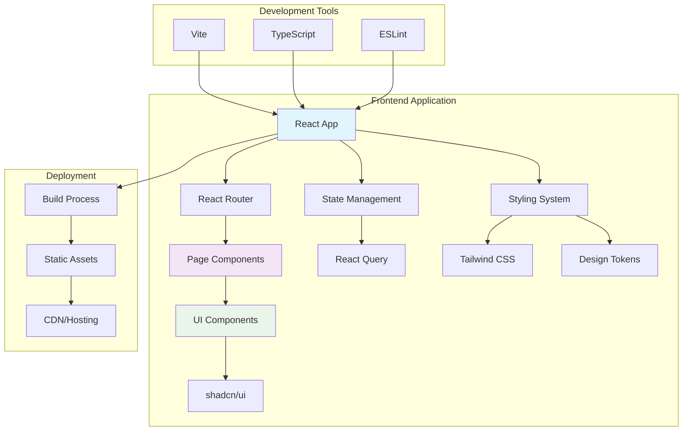
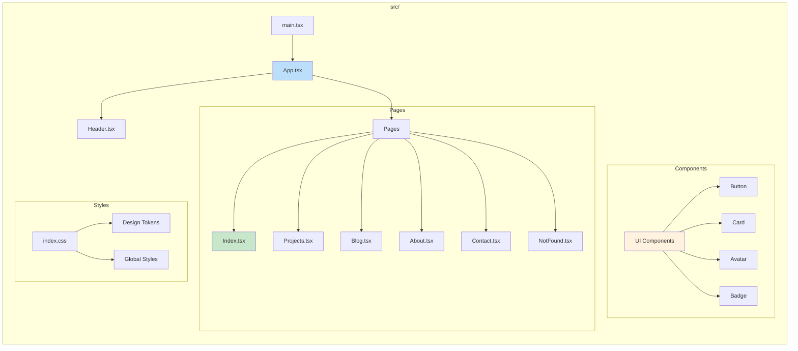
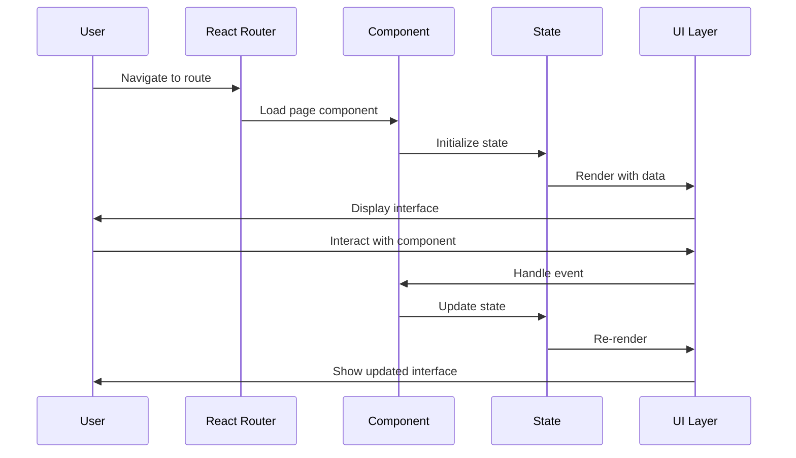
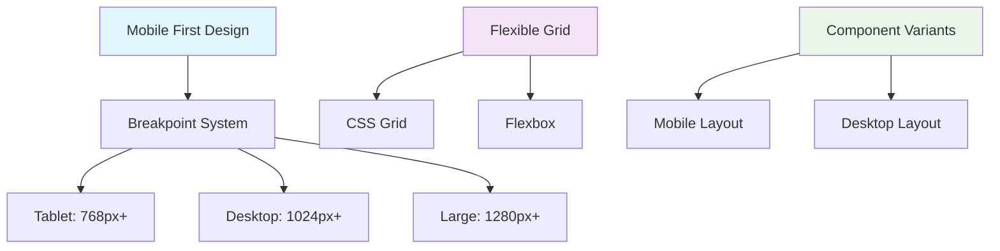
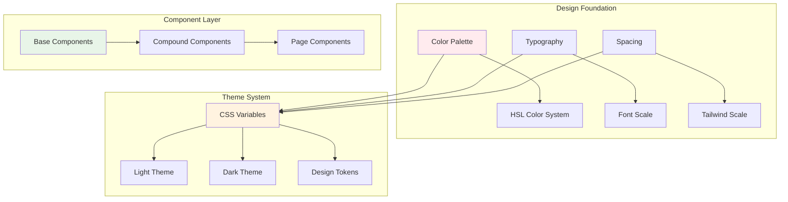
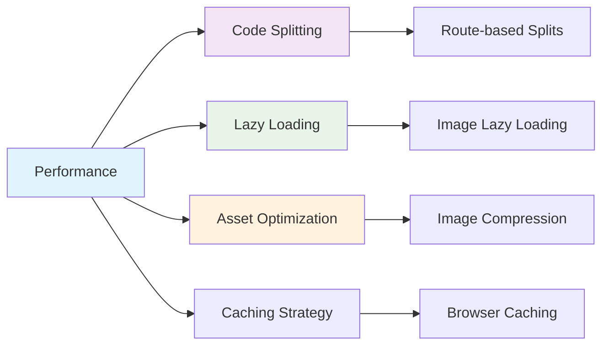
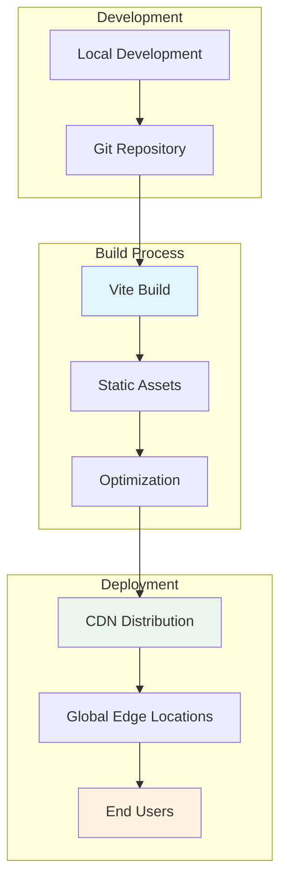
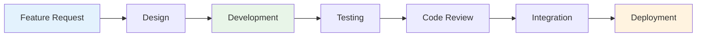

# Architecture Overview

This document provides a comprehensive overview of the portfolio website's architecture, including system design, data flow, and technology stack.

## 🏗️ System Architecture

## 🔧 Technology Stack

### Core Technologies
- **React 18**: Modern React with hooks and concurrent features
- **TypeScript**: Type-safe JavaScript development
- **Vite**: Fast build tool and development server

### UI & Styling
- **Tailwind CSS**: Utility-first CSS framework
- **shadcn/ui**: High-quality React component library
- **Lucide React**: Beautiful SVG icons

### Routing & State
- **React Router v6**: Declarative routing for React
- **TanStack Query**: Server state management

### Development Tools
- **ESLint**: Code linting and formatting
- **PostCSS**: CSS processing
- **Path Mapping**: Clean import paths with `@/` prefix

## 🏛️ Application Structure

## 🔄 Data Flow

## 📱 Responsive Design Strategy

## 🎨 Design System Architecture

## 🔐 Security Considerations

- **Client-Side Only**: No sensitive server-side operations
- **Static Assets**: All content is public and static
- **XSS Prevention**: React's built-in protections
- **Content Security**: Proper HTTPS in production

## ⚡ Performance Strategy

## 🚀 Deployment Architecture

## 📊 Monitoring & Analytics

- **Performance Monitoring**: Web Vitals tracking
- **Error Tracking**: Console error monitoring
- **User Analytics**: Behavior tracking (if implemented)
- **Build Analytics**: Bundle size monitoring

## 🔄 Development Workflow

This architecture provides a solid foundation for a modern, performant, and maintainable portfolio website.