# Routing Architecture

This document outlines the routing structure, navigation patterns, and URL management strategy for the portfolio application.

## 🗺️ Route Structure

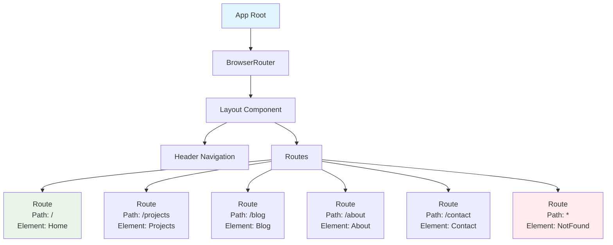

## 📋 Route Configuration

### Primary Routes
```typescript
const routes = [
  {
    path: "/",
    component: Index,
    name: "Home",
    description: "Portfolio landing page with hero, projects, and contact"
  },
  {
    path: "/projects",
    component: Projects,
    name: "Projects",
    description: "Detailed project showcase and case studies"
  },
  {
    path: "/blog",
    component: Blog,
    name: "Blog",
    description: "Technical articles and thoughts"
  },
  {
    path: "/about",
    component: About,
    name: "About",
    description: "Personal background and professional journey"
  },
  {
    path: "/contact",
    component: Contact,
    name: "Contact",
    description: "Contact form and professional links"
  },
  {
    path: "*",
    component: NotFound,
    name: "404",
    description: "Fallback page for unmatched routes"
  }
];
```

## 🧭 Navigation Flow

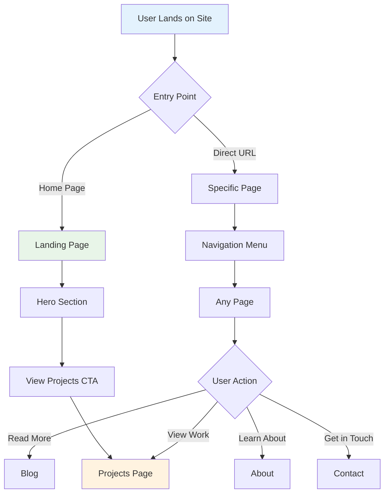

## 🔄 Route Transitions

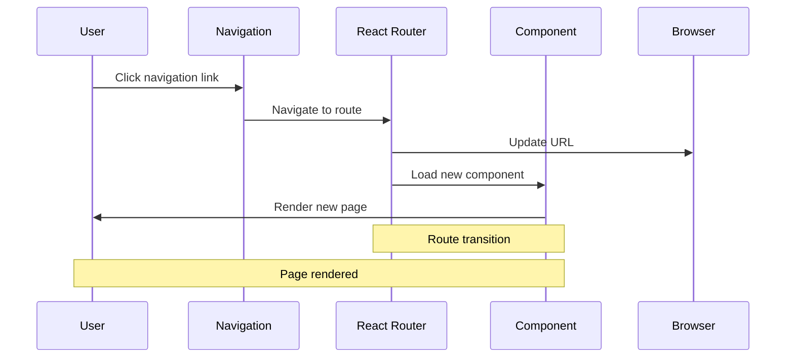

## 📱 Mobile Navigation

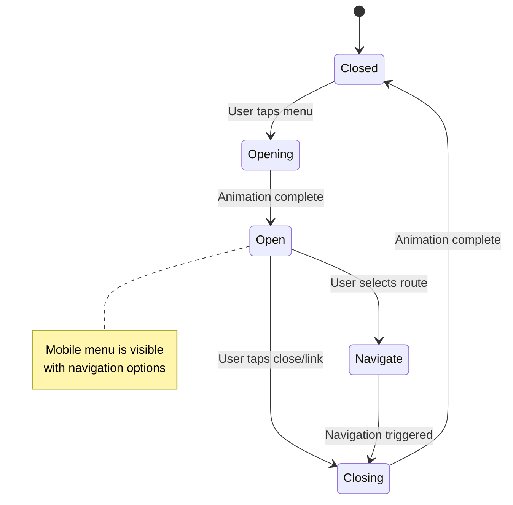

## 🔗 Link Management

### Internal Navigation
```typescript
// Using React Router Link component
<Link to="/projects" className="nav-link">
  Projects
</Link>

// Programmatic navigation
const navigate = useNavigate();
navigate('/contact');
```

### External Links
```typescript
// External links with security
<a 
  href="https://github.com/username" 
  target="_blank" 
  rel="noopener noreferrer"
>
  GitHub
</a>
```

## 🎯 Active Route Detection

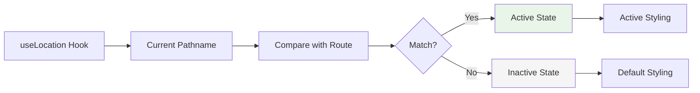

### Implementation
```typescript
const location = useLocation();

const isActive = (path: string) => location.pathname === path;

// Usage in navigation
<Link
  to="/projects"
  className={`nav-link ${isActive('/projects') ? 'active' : ''}`}
>
  Projects
</Link>
```

## 🛡️ Route Protection & Error Handling

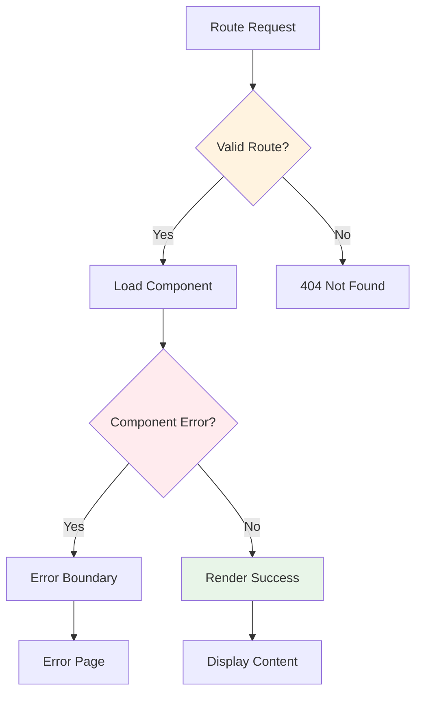

## 📊 SEO & Meta Management

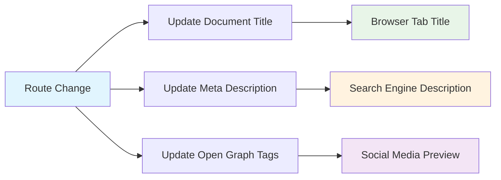

### Meta Tags per Route
```typescript
const routeMeta = {
  '/': {
    title: 'Djoko Waluyo - AI Engineer & Data Analyst',
    description: 'Portfolio of Djoko Waluyo, showcasing AI engineering projects and data analysis expertise.',
    keywords: 'AI Engineer, Data Analyst, Machine Learning, Portfolio'
  },
  '/projects': {
    title: 'Projects - Djoko Waluyo',
    description: 'Explore my latest projects in AI, machine learning, and data analysis.',
    keywords: 'AI Projects, Machine Learning, Data Science, Software Development'
  },
  '/blog': {
    title: 'Blog - Djoko Waluyo',
    description: 'Technical articles and insights on AI, data science, and software development.',
    keywords: 'Tech Blog, AI Articles, Data Science, Programming'
  }
};
```

## 🔍 URL Structure Strategy

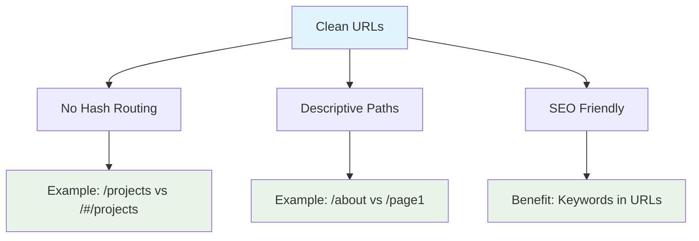

### URL Patterns
- **Home**: `/` - Clean root for landing page
- **Projects**: `/projects` - Clear project showcase
- **Blog**: `/blog` - Simple blog section
- **About**: `/about` - Personal information
- **Contact**: `/contact` - Contact form and links

## 🔄 Browser History Management

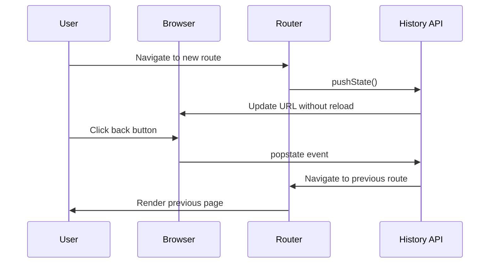

## 📱 Responsive Navigation Patterns

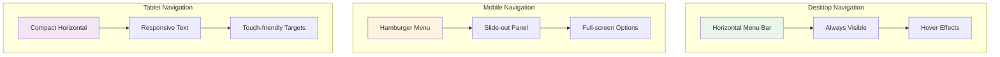

## 🎨 Navigation Animation Strategy

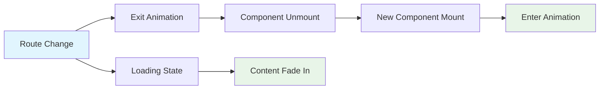

## 🔧 Performance Considerations

### Route-based Code Splitting
```typescript
// Lazy loading for better performance
const Projects = lazy(() => import('./pages/Projects'));
const Blog = lazy(() => import('./pages/Blog'));
const About = lazy(() => import('./pages/About'));

// Wrapped with Suspense
<Suspense fallback={<LoadingSpinner />}>
  <Routes>
    <Route path="/projects" element={<Projects />} />
    <Route path="/blog" element={<Blog />} />
    <Route path="/about" element={<About />} />
  </Routes>
</Suspense>
```

### Preloading Strategy
```mermaid
graph LR
    A[Current Page] --> B[Preload Critical Routes]
    B --> C[/projects on hover]
    B --> D[/contact on scroll]
    
    E[User Intent] --> F[Predictive Loading]
    F --> G[Faster Navigation]
    
    style A fill:#e1f5fe
    style G fill:#e8f5e8
```

This routing architecture ensures smooth navigation, optimal performance, and excellent user experience across all devices and platforms.
