# Design System Overview

This document outlines the comprehensive design system that powers the portfolio website, ensuring consistency, accessibility, and maintainability across all components and pages.

## 🎨 Design Philosophy

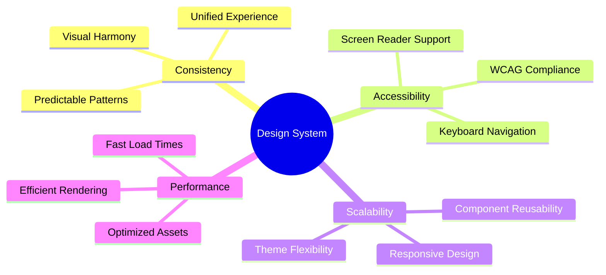

## 🏗️ System Architecture

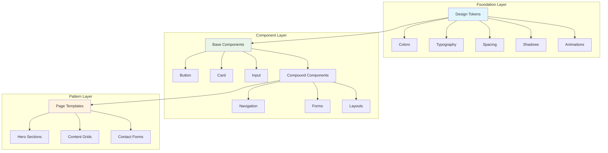

## 🎯 Design Tokens

### Color System
The color system is built on HSL values for better manipulation and accessibility.

```mermaid
graph LR
    subgraph "Primary Colors"
        A[Primary] --> A1[#222.2 47.4% 11.2%]
        B[Primary Foreground] --> B1[#210 40% 98%]
    end
    
    subgraph "Semantic Colors"
        C[Success] --> C1[#142.1 76.2% 36.3%]
        D[Warning] --> D1[#47.9 95.8% 53.1%]
        E[Error] --> E1[#0 84.2% 60.2%]
    end
    
    subgraph "Neutral Colors"
        F[Background] --> F1[#0 0% 100%]
        G[Foreground] --> G1[#222.2 84% 4.9%]
        H[Muted] --> H1[#210 40% 96.1%]
    end
    
    style A fill:#1e293b
    style C fill:#16a34a
    style D fill:#eab308
    style E fill:#dc2626
```

### Typography Scale
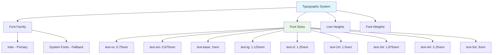

### Spacing System
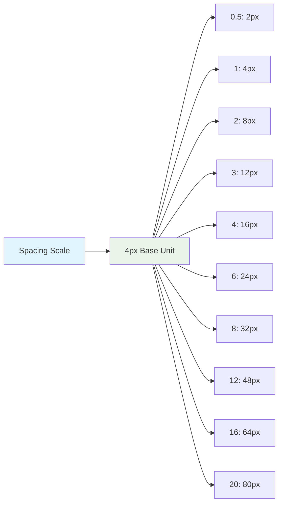

## 🎭 Theme System

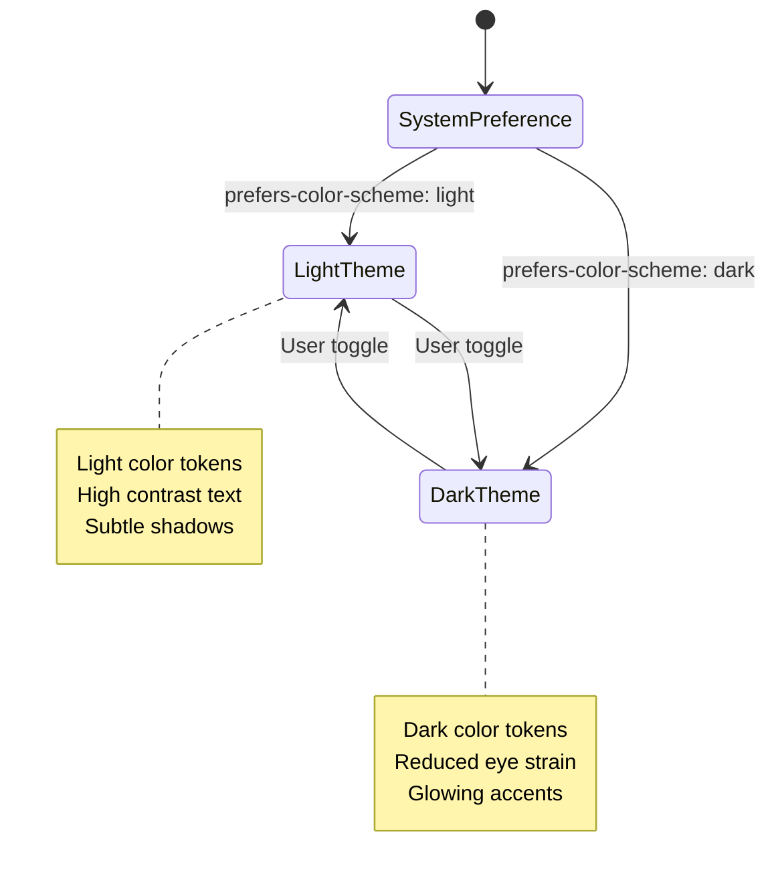

### Theme Implementation
```css
:root {
  /* Light theme variables */
  --background: 0 0% 100%;
  --foreground: 222.2 84% 4.9%;
  --primary: 222.2 47.4% 11.2%;
}

.dark {
  /* Dark theme variables */
  --background: 222.2 84% 4.9%;
  --foreground: 210 40% 98%;
  --primary: 210 40% 98%;
}
```

## 🧩 Component System

### Button Variants
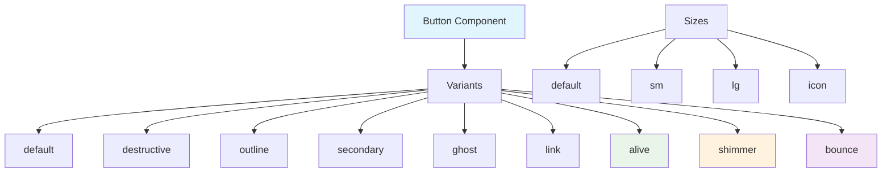

### Animation System
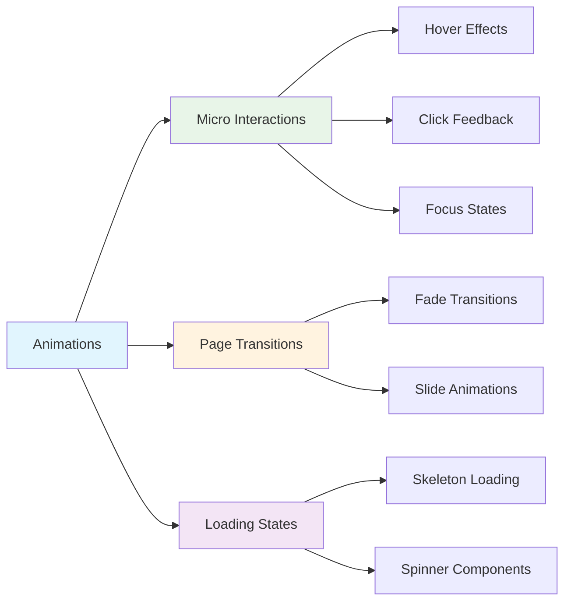

## 📐 Layout System

### Grid Structure
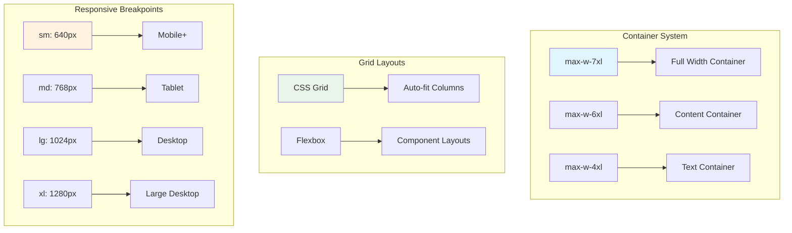

## 🎨 Visual Hierarchy

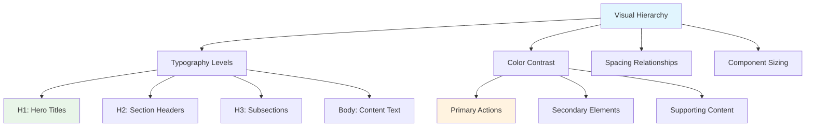

## 🔧 Component API Design

### Consistent Props Pattern
```typescript
interface ComponentProps {
  // Visual variants
  variant?: 'default' | 'secondary' | 'destructive';
  size?: 'sm' | 'default' | 'lg';
  
  // Common props
  className?: string;
  children?: React.ReactNode;
  
  // Component-specific props
  onClick?: () => void;
  disabled?: boolean;
}
```

## ♿ Accessibility Standards

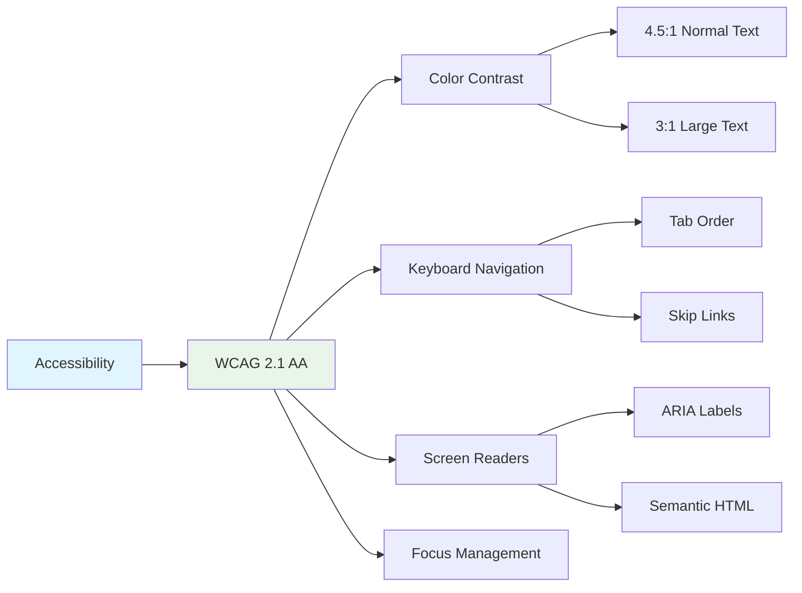

## 📱 Responsive Design Principles

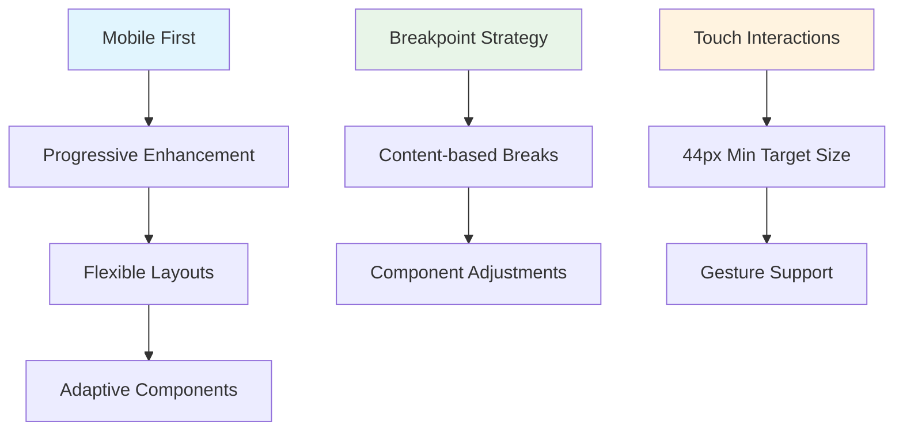

## 🔄 Design Token Usage

### CSS Custom Properties
```css
.component {
  background: hsl(var(--background));
  color: hsl(var(--foreground));
  border: 1px solid hsl(var(--border));
  border-radius: var(--radius);
  padding: var(--spacing-4);
}
```

### Tailwind Integration
```typescript
// tailwind.config.ts
export default {
  theme: {
    extend: {
      colors: {
        primary: 'hsl(var(--primary))',
        secondary: 'hsl(var(--secondary))',
        background: 'hsl(var(--background))',
      }
    }
  }
}
```

## 📊 Design System Metrics

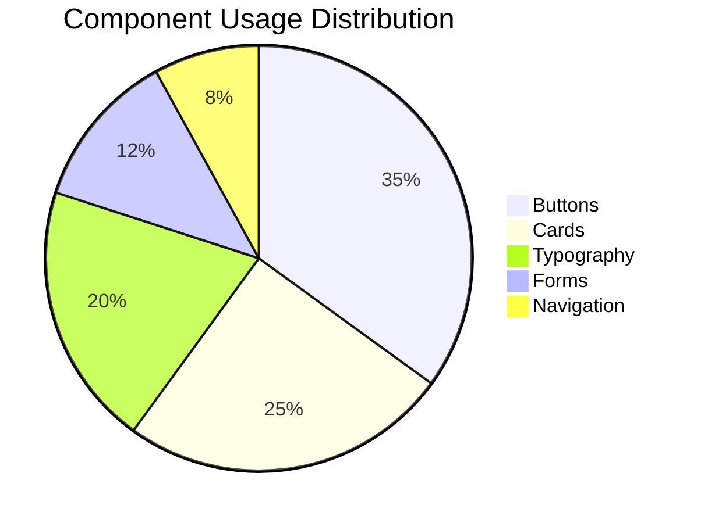

## 🔍 Quality Assurance

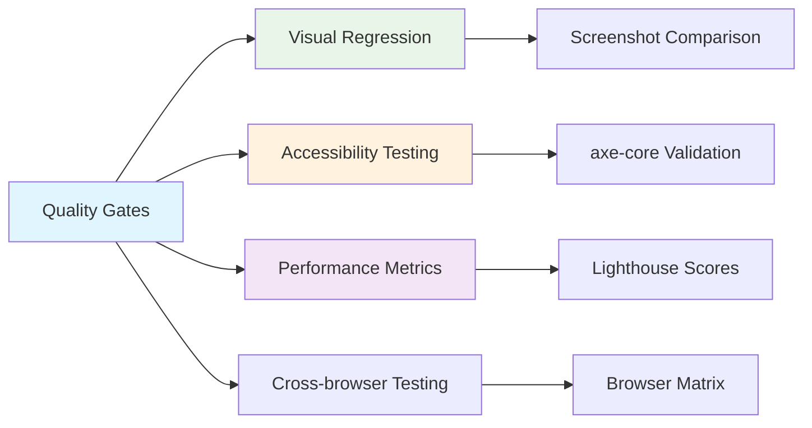

This design system ensures a cohesive, accessible, and maintainable user interface across the entire portfolio application.