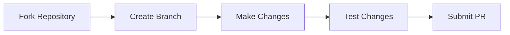

# Contributing Guide

## 🤝 How to Contribute



## 📝 Code Standards
- Use TypeScript for all new code
- Follow existing component patterns
- Include proper documentation
- Maintain accessibility standards
- Write meaningful commit messages

## 🧪 Testing Requirements
- Unit tests for new components
- Integration tests for features
- Cross-browser compatibility
- Mobile responsiveness verification

## 📋 Pull Request Template
```markdown
## Description
Brief description of changes

## Type of Change
- [ ] Bug fix
- [ ] New feature
- [ ] Documentation update
- [ ] Performance improvement

## Testing
- [ ] Tests pass locally
- [ ] Cross-browser tested
- [ ] Mobile tested
```

## 🎯 Development Focus Areas
- Component reusability
- Performance optimization
- Accessibility improvements
- Documentation updates