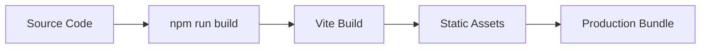

# Deployment Guide

## 🚀 Build Process



## 📦 Deployment Options

### Lovable Platform (Recommended)
1. Click "Publish" in Lovable interface
2. Automatic deployment to CDN
3. Custom domain support available

### Manual Deployment
```bash
# Build for production
npm run build

# Deploy dist/ folder to hosting platform
# (Netlify, Vercel, GitHub Pages, etc.)
```

## ✅ Pre-deployment Checklist
- [ ] All tests passing
- [ ] Build completed successfully  
- [ ] SEO meta tags configured
- [ ] Performance optimized
- [ ] Cross-browser tested

## 🔧 Environment Configuration
```bash
# Production environment variables
NODE_ENV=production
VITE_APP_NAME="Djoko Waluyo Portfolio"
```

Deploy your portfolio with confidence using these guidelines.