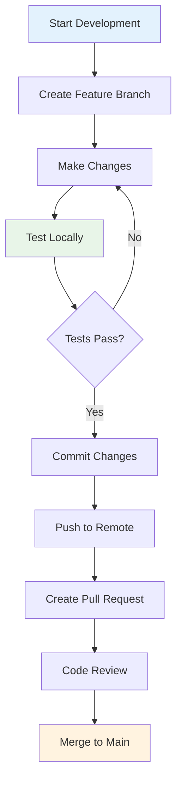
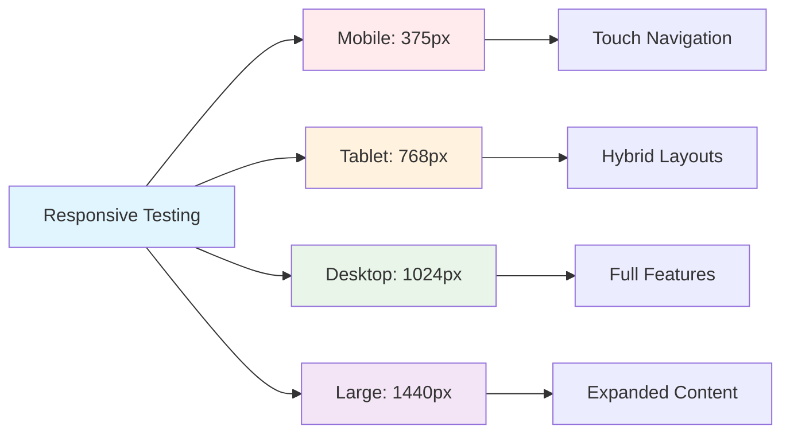
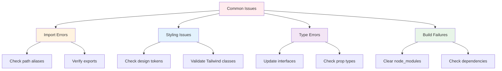

# Getting Started Guide

This comprehensive guide will help you set up the development environment, understand the project structure, and start contributing to the portfolio website.

## 🚀 Quick Setup

### Prerequisites
Ensure you have the following installed on your system:

```mermaid
graph LR
    A[Prerequisites] --> B[Node.js 18+]
    A --> C[npm or yarn]
    A --> D[Git]
    A --> E[VS Code (Recommended)]
    
    B --> F[Runtime Environment]
    C --> G[Package Manager]
    D --> H[Version Control]
    E --> I[Code Editor]
    
    style A fill:#e1f5fe
    style B fill:#e8f5e8
    style E fill:#fff3e0
```

### Installation Steps

1. **Clone the Repository**
   ```bash
   git clone <repository-url>
   cd portfolio-project
   ```

2. **Install Dependencies**
   ```bash
   npm install
   # or
   yarn install
   ```

3. **Start Development Server**
   ```bash
   npm run dev
   # or
   yarn dev
   ```

4. **Open in Browser**
   Navigate to `http://localhost:8080`

## 📁 Project Structure

```mermaid
graph TB
    subgraph "Root Directory"
        A[portfolio-project/] --> B[src/]
        A --> C[public/]
        A --> D[docs/]
        A --> E[Configuration Files]
    end
    
    subgraph "Source Code (src/)"
        B --> F[components/]
        B --> G[pages/]
        B --> H[hooks/]
        B --> I[lib/]
        B --> J[assets/]
    end
    
    subgraph "Components Structure"
        F --> K[ui/ (shadcn components)]
        F --> L[Header.tsx]
        F --> M[Footer.tsx]
    end
    
    subgraph "Pages Structure"
        G --> N[Index.tsx (Home)]
        G --> O[Projects.tsx]
        G --> P[Blog.tsx]
        G --> Q[About.tsx]
        G --> R[Contact.tsx]
    end
    
    style A fill:#e1f5fe
    style B fill:#e8f5e8
    style F fill:#fff3e0
    style G fill:#f3e5f5
```

### Directory Breakdown

```
portfolio-project/
├── 📁 src/
│   ├── 📁 components/          # Reusable React components
│   │   ├── 📁 ui/             # shadcn/ui components
│   │   └── Header.tsx         # Navigation header
│   ├── 📁 pages/              # Page components
│   │   ├── Index.tsx          # Home page
│   │   ├── Projects.tsx       # Projects showcase
│   │   ├── Blog.tsx           # Blog section
│   │   ├── About.tsx          # About page
│   │   └── Contact.tsx        # Contact form
│   ├── 📁 hooks/              # Custom React hooks
│   ├── 📁 lib/                # Utility functions
│   ├── 📁 assets/             # Static assets
│   ├── index.css              # Global styles & design tokens
│   ├── main.tsx               # Application entry point
│   └── App.tsx                # Root component
├── 📁 public/                 # Static files
├── 📁 docs/                   # Documentation
├── package.json               # Dependencies & scripts
├── vite.config.ts             # Vite configuration
├── tailwind.config.ts         # Tailwind CSS configuration
└── tsconfig.json              # TypeScript configuration
```

## 🛠️ Development Workflow



### Development Commands

```bash
# Start development server
npm run dev

# Build for production
npm run build

# Preview production build
npm run preview

# Lint code
npm run lint

# Type checking
npm run type-check
```

## 🎨 Working with Components

### Creating New Components

1. **Create Component File**
   ```typescript
   // src/components/NewComponent.tsx
   import React from 'react';
   
   interface NewComponentProps {
     title: string;
     description?: string;
     variant?: 'default' | 'secondary';
   }
   
   const NewComponent: React.FC<NewComponentProps> = ({
     title,
     description,
     variant = 'default'
   }) => {
     return (
       <div className={`component-base ${variant}`}>
         <h3>{title}</h3>
         {description && <p>{description}</p>}
       </div>
     );
   };
   
   export default NewComponent;
   ```

2. **Follow Component Patterns**
   ```mermaid
   graph LR
       A[Component Creation] --> B[TypeScript Interface]
       A --> C[Props Validation]
       A --> D[Semantic HTML]
       A --> E[Tailwind Classes]
       A --> F[Accessibility]
       
       B --> G[Type Safety]
       C --> H[Runtime Checks]
       D --> I[SEO & A11y]
       E --> J[Consistent Styling]
       F --> K[WCAG Compliance]
       
       style A fill:#e1f5fe
       style G fill:#e8f5e8
   ```

### Using shadcn/ui Components

```typescript
// Import from the ui directory
import { Button } from "@/components/ui/button";
import { Card, CardContent, CardHeader } from "@/components/ui/card";

// Use with proper variants and props
<Button variant="outline" size="lg">
  Click me
</Button>

<Card>
  <CardHeader>
    <h3>Card Title</h3>
  </CardHeader>
  <CardContent>
    <p>Card content goes here</p>
  </CardContent>
</Card>
```

## 🎯 Styling Guidelines

### Design Token Usage
```css
/* ✅ Correct - Use design tokens */
.component {
  background: hsl(var(--background));
  color: hsl(var(--foreground));
  border: 1px solid hsl(var(--border));
}

/* ❌ Incorrect - Avoid hardcoded colors */
.component {
  background: #ffffff;
  color: #000000;
  border: 1px solid #e5e5e5;
}
```

### Tailwind Best Practices
```typescript
// ✅ Responsive classes
<div className="grid grid-cols-1 md:grid-cols-2 lg:grid-cols-3 gap-4">

// ✅ Semantic color classes
<button className="bg-primary text-primary-foreground">

// ✅ Component variants
<Button variant="outline" size="lg">
```

## 🔧 Configuration Files

### Vite Configuration
```typescript
// vite.config.ts
export default defineConfig({
  plugins: [react()],
  resolve: {
    alias: {
      "@": path.resolve(__dirname, "./src"),
    },
  },
});
```

### Tailwind Configuration
```typescript
// tailwind.config.ts
export default {
  darkMode: ["class"],
  content: ["./src/**/*.{ts,tsx}"],
  theme: {
    extend: {
      colors: {
        border: "hsl(var(--border))",
        primary: "hsl(var(--primary))",
      },
    },
  },
} satisfies Config;
```

## 📱 Responsive Development

### Breakpoint Testing


### Device Testing Strategy
1. **Chrome DevTools** - Primary testing
2. **Firefox DevTools** - Cross-browser validation
3. **Real Devices** - Touch interaction testing
4. **BrowserStack** - Comprehensive device matrix

## 🧪 Testing Guidelines

### Component Testing
```typescript
// Example test structure
import { render, screen } from '@testing-library/react';
import { Button } from './Button';

test('renders button with correct text', () => {
  render(<Button>Click me</Button>);
  expect(screen.getByText('Click me')).toBeInTheDocument();
});

test('handles click events', () => {
  const handleClick = jest.fn();
  render(<Button onClick={handleClick}>Click me</Button>);
  
  screen.getByText('Click me').click();
  expect(handleClick).toHaveBeenCalledTimes(1);
});
```

## 🔍 Debugging Tips

### Common Issues & Solutions



### Development Tools
- **React DevTools** - Component inspection
- **VS Code Extensions** - Enhanced development
- **Browser DevTools** - Network and performance
- **Lighthouse** - Performance auditing

## 📦 Package Management

### Adding New Dependencies
```bash
# Production dependency
npm install package-name

# Development dependency
npm install -D package-name

# Update dependencies
npm update
```

### Dependency Guidelines
- **Prefer lightweight libraries** over feature-heavy ones
- **Check bundle impact** with webpack-bundle-analyzer
- **Maintain security** with npm audit
- **Keep updated** but test thoroughly

## 🚀 Deployment Preparation

### Build Optimization
```bash
# Production build
npm run build

# Analyze bundle
npm run build -- --analyze

# Test production build locally
npm run preview
```

### Pre-deployment Checklist
- [ ] All tests passing
- [ ] No TypeScript errors
- [ ] Lighthouse score > 90
- [ ] Cross-browser testing complete
- [ ] Mobile responsiveness verified
- [ ] SEO meta tags updated

This guide provides everything needed to start developing effectively with the portfolio project. For more specific topics, refer to the other documentation files in this directory.